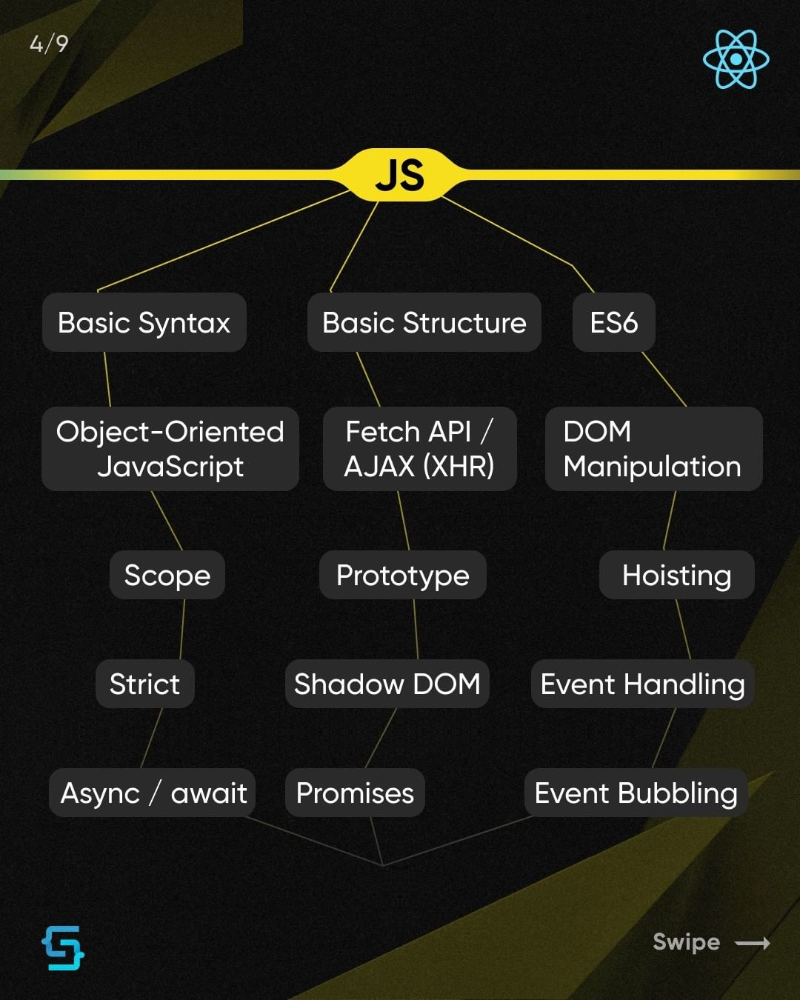

# RoadMap

 

        <input type="radio" name="navegacion" id="1" checked>
        <input type="radio" name="navegacion" id="2">
        <input type="radio" name="navegacion" id="3">
        <input type="radio" name="navegacion" id="4">
        <input type="radio" name="navegacion" id="5">
        
        
        
        
        

